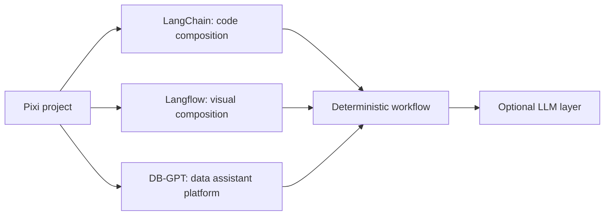
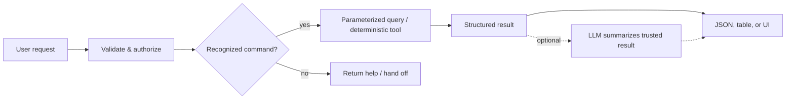
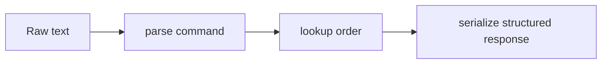
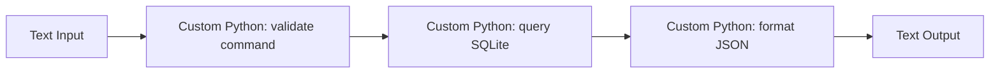
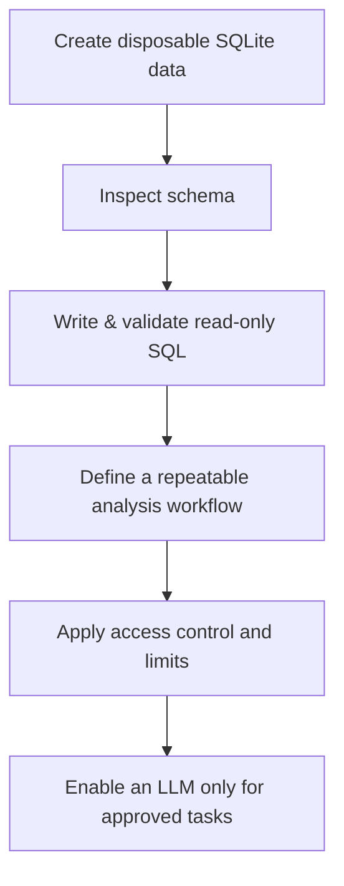
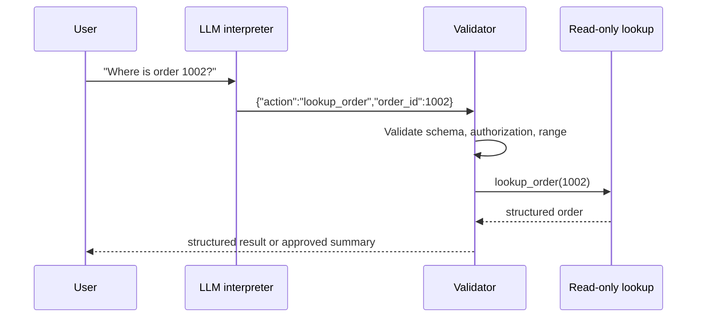

# From Deterministic Data Workflows to LLM Applications
## A practical primer for Langflow, LangChain, DB-GPT, and Pixi

**Audience:** Python beginners through working practitioners  
**Primary route:** Build reliable workflows *without* an LLM first. Add an LLM only after the deterministic system is useful, tested, and secure.  
**Last reviewed:** 2026-09-02

## How to use this primer

Work through the stages in order. Each stage has a goal, a small implementation, and exercises. Do not skip the non-LLM foundations: they are the parts that make later AI features safe, testable, and maintainable.

> **Important distinction:** An LLM is a type of model that produces or transforms language. A workflow can still load files, validate data, query a database, call APIs, route requests, render results, and log outcomes without one. That is where this guide starts.

## 1. The map: what each tool is for

| Tool | Best mental model | What it contributes | LLM required? |
|---|---|---|---|
| **Pixi** | Reproducible project workshop | Environments, packages, lock file, repeatable commands | No |
| **LangChain** | Python composition toolkit | Connect small steps into a typed, testable pipeline | No |
| **Langflow** | Visual workflow workbench | Design, run, inspect, share, and serve flows visually | No, although it is AI-oriented |
| **DB-GPT** | Data-assistant platform | Data connections, workflows, skills, agents, analysis, and a web UI | Its natural-language assistant capabilities do; ordinary database work does not |



### What “professional” means here

A professional system is not merely one that produces an impressive answer. It has an explicit contract, controlled data access, observable executions, reproducible dependencies, tests, failure handling, and a deployment plan.

## 2. Core ideas before installation

### 2.1 Workflow vocabulary

- **Input:** a file, HTTP request, form value, event, or database record.
- **Transform:** a deterministic operation such as parsing CSV, normalizing dates, or computing a total.
- **Validation:** rules that accept or reject malformed or unsafe input.
- **Router:** selects a branch according to explicit rules.
- **Tool:** a callable ability such as `lookup_order` or `get_customer_total`.
- **Output:** structured JSON, a table, an API response, or a rendered view.
- **LLM (optional):** turns unstructured human language into structured intent, or turns trusted structured results into prose. It should not replace authorization or validation.

### 2.2 A dependable design boundary

Keep correctness-critical work deterministic. The database query, permissions check, arithmetic, and write operation should remain conventional program logic. An LLM, if added, belongs at the interpretation or presentation edge.



### 2.3 The running project: an order lookup service

You will create a small service that accepts a known command, safely queries a SQLite database, returns structured data, and later gains an optional natural-language interface.

The initial supported command will be:

```text
order:1002
```

It is deliberately constrained. A reliable system should expand its vocabulary only after its existing behavior is tested.

## 3. Stage 0 — set up Pixi

Pixi is a cross-platform package manager and workflow tool. Its project manifest describes desired dependencies, and its lock file records resolved versions so collaborators can reproduce the environment. See the [official Pixi installation guide](https://prefix-dev.github.io/pixi/latest/installation/) and [project overview](https://github.com/prefix-dev/pixi/).

### 3.1 Install Pixi

On Linux or macOS:

```bash
curl -fsSL https://pixi.sh/install.sh | sh
```

On Windows PowerShell:

```powershell
powershell -ExecutionPolicy Bypass -c "irm -useb https://pixi.sh/install.ps1 | iex"
```

Restart your shell, then verify it:

```bash
pixi --version
```

### 3.2 Initialize the project

```bash
pixi init deterministic-data-workflows
cd deterministic-data-workflows
pixi add python
pixi add --pypi langchain langchain-core
pixi add --pypi pytest
```

Use Pixi commands rather than manually guessing manifest syntax: they update the project manifest and lock file for you.

Add convenient project tasks:

```bash
pixi task add seed "python seed_db.py"
pixi task add lookup "python order_lookup.py"
pixi task add test "pytest -q"
```

Your working tree will resemble:

```text
 deterministic-data-workflows/
 ├── pixi.toml          # Project intent: dependencies and tasks
 ├── pixi.lock          # Resolved, reproducible dependency set
 ├── seed_db.py
 ├── order_lookup.py
 └── tests/
     └── test_order_lookup.py
```

Commit `pixi.toml` and `pixi.lock`. Do not commit database files that contain sensitive real data or environment files containing secrets.

### Exercise 0

1. Run `pixi run python --version`.
2. Run `pixi run seed` after creating the next file.
3. In one sentence each, explain the difference between `pixi.toml` and `pixi.lock`.

## 4. Stage 1 — build a deterministic data pipeline in Python

Create `seed_db.py`:

```python
import sqlite3

with sqlite3.connect("orders.db") as connection:
    connection.execute("DROP TABLE IF EXISTS orders")
    connection.execute(
        """
        CREATE TABLE orders (
            order_id INTEGER PRIMARY KEY,
            customer_name TEXT NOT NULL,
            status TEXT NOT NULL,
            total_cents INTEGER NOT NULL CHECK(total_cents >= 0)
        )
        """
    )
    connection.executemany(
        "INSERT INTO orders VALUES (?, ?, ?, ?)",
        [
            (1001, "Avery", "shipped", 2599),
            (1002, "Blake", "processing", 4200),
            (1003, "Casey", "delivered", 1599),
        ],
    )
```

Create `order_lookup.py`:

```python
import re
import sqlite3
from dataclasses import asdict, dataclass

COMMAND = re.compile(r"^order:(?P<order_id>\d+)$")

@dataclass(frozen=True)
class Order:
    order_id: int
    customer_name: str
    status: str
    total_cents: int


def parse_command(text: str) -> int:
    match = COMMAND.fullmatch(text.strip())
    if not match:
        raise ValueError("Expected a command such as order:1002")
    return int(match.group("order_id"))


def lookup_order(order_id: int, database_path: str = "orders.db") -> Order | None:
    with sqlite3.connect(database_path) as connection:
        row = connection.execute(
            "SELECT order_id, customer_name, status, total_cents "
            "FROM orders WHERE order_id = ?",
            (order_id,),
        ).fetchone()
    return Order(*row) if row else None


def handle(text: str) -> dict:
    order_id = parse_command(text)
    order = lookup_order(order_id)
    if order is None:
        return {"found": False, "order_id": order_id}
    return {"found": True, "order": asdict(order)}


if __name__ == "__main__":
    print(handle("order:1002"))
```

Run it:

```bash
pixi run seed
pixi run lookup
```

### Why this is a good first workflow

- The syntax is clear and testable.
- The regular expression defines the accepted input.
- The query is parameterized: the value is passed separately from the SQL command.
- The program returns a predictable dictionary rather than unverified prose.
- The tool does one thing: read one order.

### Exercises 1

1. Add an order with a `cancelled` status and verify lookup.
2. Try `order:hello`; confirm the program rejects it.
3. Add a `format_money` function that converts `4200` to `$42.00`. Test it independently.
4. Why is this unsafe?

```python
connection.execute(f"SELECT * FROM orders WHERE order_id = {user_value}")
```

**Answer check:** It treats user-provided text as part of SQL. Use placeholders and bound values instead.

## 5. Stage 2 — test the contract before you add frameworks

Create `tests/test_order_lookup.py`:

```python
from order_lookup import handle, parse_command


def test_parse_command_accepts_known_format():
    assert parse_command("order:1002") == 1002


def test_parse_command_rejects_unknown_format():
    try:
        parse_command("where is 1002?")
    except ValueError as error:
        assert "Expected a command" in str(error)
    else:
        raise AssertionError("Expected ValueError")


def test_missing_order_has_stable_response(tmp_path):
    database = tmp_path / "empty.db"
    # This test documents a desired contract; seed the test database as appropriate.
    assert isinstance(str(database), str)
```

Run:

```bash
pixi run test
```

The final test is intentionally incomplete: it is an exercise in creating isolated test data rather than relying on a developer’s local `orders.db`.

### Professional habits introduced

1. Define accepted inputs and response shapes.
2. Test successful, invalid, missing, unauthorized, and failure cases.
3. Keep test data disposable and isolated.
4. Log an event ID and timing, but avoid logging private customer data by default.

## 6. Stage 3 — LangChain without an LLM

LangChain is commonly used for LLM applications, but its composition model is useful without a model call. A **Runnable** is an invokable unit. Combine ordinary Python functions into a pipeline, then test them exactly as you test other code.



Create `langchain_pipeline.py`:

```python
from dataclasses import asdict
from langchain_core.runnables import RunnableLambda

from order_lookup import lookup_order, parse_command


def serialize(order):
    if order is None:
        return {"found": False}
    return {"found": True, "order": asdict(order)}

pipeline = (
    RunnableLambda(parse_command)
    | RunnableLambda(lookup_order)
    | RunnableLambda(serialize)
)

if __name__ == "__main__":
    print(pipeline.invoke("order:1002"))
```

Add and run a task:

```bash
pixi task add pipeline "python langchain_pipeline.py"
pixi run pipeline
```

### When LangChain is useful without an LLM

- Normalizing input and mapping it to an explicit command.
- Branching by deterministic business rules.
- Joining API, database, and file operations.
- Standardizing an application interface around `invoke` and batches.
- Preparing a clean seam where an LLM may later be substituted or added.

### When it is not useful

For a three-line script, a framework may obscure rather than clarify. Use the smallest abstraction that improves readability, tests, or integration.

### Exercise 2 — add a router

Extend the command language with `health`. It should return `{"ok": True}` without opening the database.

Pseudocode:

```text
if input == "health":
    return health response
otherwise:
    parse and execute order lookup
```

Do this with an ordinary Python function first. Only then wrap that function in `RunnableLambda`.

## 7. Stage 4 — Langflow without an LLM

Langflow is a visual environment for composing flows. Its official project describes visual authoring, an interactive playground, and the ability to expose a flow as an API or export it as JSON. It supports many model and vector integrations, but its components and custom Python capability can also model ordinary deterministic workflows. See [Langflow’s overview](https://www.langflow.org/) and its [source project](https://github.com/langflow-ai/langflow).

### 7.1 Install and run in the Pixi environment

Add Langflow as a PyPI dependency, then run it through Pixi:

```bash
pixi add --pypi langflow
pixi task add langflow "langflow run"
pixi run langflow
```

The Langflow project’s current quickstart documents a local server at `http://127.0.0.1:7860`; consult the [upstream quickstart](https://github.com/langflow-ai/langflow) if a future release changes this.

### 7.2 Your first visual non-LLM flow

Use this design rather than a chatbot template:



In Langflow’s canvas:

1. Create a blank flow named `Order Lookup — Deterministic`.
2. Add an input component that accepts text.
3. Add a custom Python component for command validation.
4. Add a custom Python component that calls a *read-only* lookup function.
5. Add an output component.
6. Connect compatible ports; configure no model component.
7. Run it with `order:1002`, an invalid command, and a missing ID.
8. Export the flow JSON and commit it beside your source code.

> Component names and ports evolve between Langflow releases. Use the component search panel and its inline type hints rather than copying an old screenshot or tutorial verbatim.

### Design rule: put business logic in normal Python

Keep your validation and query code in normal, version-controlled Python modules. A Langflow custom component should call those functions rather than becoming the only location where business rules exist. This lets you test the core without a browser and use it from Langflow, an API, or a command line.

### Exercise 3 — visual error route

Create two possible outputs:

- `success`: a structured order response.
- `error`: a helpful validation message.

Document the inputs and expected output for each path in the flow description.

## 8. Stage 5 — DB-GPT without an LLM: what is and is not possible

DB-GPT is an open-source data-assistant platform built around data connections, SQL/code execution, workflows, skills, and model support. Its documented AI experience includes generating SQL from natural language, planning, and report generation. See the [DB-GPT overview](http://docs.dbgpt.cn/docs/overview/) and [source project](https://github.com/eosphoros-ai/DB-GPT).

**The honest constraint:** DB-GPT is principally designed for AI + data workflows. Its headline Text-to-SQL and conversational features require a language model. “DB-GPT without an LLM” therefore means using the same disciplined data foundations—explicit connections, safe SQL, deterministic tools, and repeatable workflows—not expecting natural-language querying to work with no model.

### A useful DB-GPT learning path before enabling a model



1. **Use a disposable database.** Never learn with a production credential.
2. **Inspect schema deliberately.** Know tables, relationships, data ownership, and sensitive fields.
3. **Write the SQL yourself.** Begin with constrained `SELECT` queries.
4. **Confirm results independently.** Compare a query with an expected small result set.
5. **Treat SQL as a tool contract.** Specify inputs, allowed operation, result limit, timeout, and audit event.
6. **Explore DB-GPT workflow and skill concepts.** DB-GPT documents skills as reusable packages of instructions, optional scripts, references, and assets. That structure is valuable even before a model is in the loop.

### SQL exercise: safe reporting query

For the sample schema, write a query that returns orders with status `processing`. Keep the value parameterized in your Python code:

```python
connection.execute(
    "SELECT order_id, customer_name, total_cents FROM orders WHERE status = ?",
    ("processing",),
).fetchall()
```

Do **not** start with a database account that can modify or delete production data. Separate read and write credentials, enforce least privilege, and require explicit approval for destructive operations.

### DB-GPT and Pixi

Current DB-GPT documentation recommends `uv` in some installation paths, while its PyPI package can also be installed with `pip`. Pixi can manage Python/PyPI dependencies, but treat the DB-GPT integration as an advanced, separately tested environment: DB-GPT’s optional providers and system dependencies can be substantial. Start by following the [official DB-GPT quickstart](https://github.com/eosphoros-ai/DB-GPT/blob/main/docs/docs/quickstart.md), then decide whether to reproduce the exact dependency set in a Pixi project.

That is not a failure of Pixi. It is dependency management done carefully: do not combine major toolchains until you can reproduce each one independently.

## 9. Stage 6 — add an LLM deliberately

After the deterministic version works, an LLM can improve ergonomics. It should translate a limited set of phrases into a known command—not gain unrestricted database authority.

### 9.1 The safe pattern



The critical control point is the validator. It treats the model output as untrusted input.

### 9.2 Avoid this pattern

```text
User message -> LLM writes arbitrary SQL -> production database
```

This design makes authorization, schema constraints, cost, correctness, and auditability much harder. If your use case requires generated SQL, begin with a read-only database, table allowlist, query parser/policy checks, row limits, statement timeouts, logging, and human review for high-impact actions.

### 9.3 A practical progression

1. **Command parsing:** model emits only a validated action and ID.
2. **Answer presentation:** model summarizes a trusted structured result.
3. **Retrieval:** model uses approved, read-only documents through a retrieval layer.
4. **Text-to-SQL:** only after the query guardrails and evaluation corpus exist.
5. **Agents:** only when a multi-step planner measurably improves a controlled task.

### Exercise 4 — define the model contract

Write a JSON schema—or a Pydantic model in Python—for this action:

```json
{
  "action": "lookup_order",
  "order_id": 1002
}
```

Then list five invalid model outputs your validator must reject, such as a missing field, extra action, negative ID, string ID, or an attempt to include SQL.

## 10. Evaluation: prove the system works

A professional workflow has an evaluation set. Make a small CSV or JSON file of cases before you change prompts or add models.

| Case | Input | Expected behavior |
|---|---|---|
| Valid order | `order:1002` | Found; response has the expected fields |
| Missing order | `order:9999` | Not found; no server error |
| Invalid syntax | `find order 1002` | Validation error |
| Suspicious input | `order:1002; DROP TABLE orders` | Validation error |
| Unauthorized order | Valid ID belonging to another tenant | Denied without revealing data |

Track at least:

- **Correctness:** expected structured response appears.
- **Safety:** invalid and unauthorized inputs are blocked.
- **Latency:** measure total time and downstream database time.
- **Reliability:** failures return a stable, useful error category.
- **Cost:** measure model and infrastructure use only after models are introduced.

## 11. Observability and operations

### Minimum event record

Log structured events with fields appropriate to your environment:

```json
{
  "event": "order_lookup",
  "request_id": "generated-per-request",
  "outcome": "found",
  "duration_ms": 12
}
```

Avoid putting customer names, complete raw prompts, passwords, API keys, or unredacted records in logs unless there is a specific, approved retention policy.

### Deployment checklist

- [ ] Pin and lock dependencies with Pixi.
- [ ] Run unit tests using `pixi run test`.
- [ ] Keep secrets in the runtime environment or an approved secret manager, not source control.
- [ ] Use least-privileged, read-only credentials for lookup tools.
- [ ] Validate every external input and every LLM-produced tool call.
- [ ] Enforce rate, row, time, and result-size limits.
- [ ] Record auditable events without leaking sensitive data.
- [ ] Maintain a rollback plan and a small regression suite.
- [ ] Document known failure modes and a human escalation path.

## 12. A 6-week learning plan

| Week | Focus | Deliverable |
|---|---|---|
| 1 | Pixi + Python foundations | Reproducible project; SQLite sample database; tests |
| 2 | Deterministic data tools | Validated command parser and parameterized query |
| 3 | LangChain composition | Runnable pipeline plus tests for all branches |
| 4 | Langflow visual development | Exported non-LLM flow that calls versioned Python logic |
| 5 | DB-GPT data concepts | Safe read-only SQL workflow; data-access threat model |
| 6 | Optional LLM layer | Constrained action schema, validator, evaluation set |

### Capstone

Build a **Support Operations Lookup** application:

- Inputs: a restricted set of commands, then optional natural language.
- Data: a disposable SQLite dataset with orders, tickets, and products.
- Deterministic core: explicit tools for each resource.
- Visual flow: Langflow for a transparent diagram of routing and outputs.
- Data platform study: DB-GPT concepts applied to datasource, workflow, and skill boundaries.
- LLM extension: constrained intent extraction only; no arbitrary write actions.
- Evidence: README, Pixi lock file, tests, evaluation cases, threat model, and one exported flow.

## 13. Troubleshooting guide

| Symptom | Likely cause | First action |
|---|---|---|
| `pixi` is not found | Shell has not reloaded its PATH | Restart terminal; run the installation verification again |
| Dependencies differ on two machines | Lock file missing or not committed | Commit `pixi.lock`; run `pixi install` |
| Langflow canvas has different components than a tutorial | Version or bundle differences | Check current built-in component search and documentation |
| Database query fails | Schema/path mismatch | Inspect the database path and query schema directly |
| LLM produces unexpected tool instructions | Weak or absent validation | Reject the output; tighten the structured contract and validator |
| DB-GPT setup becomes large or slow | Optional providers/model integrations | Start with its official minimal path and isolate the environment |

## 14. Glossary

- **API:** an interface through which software systems exchange requests and responses.
- **Deterministic:** the same input and state yield the same output.
- **Embedding:** a numeric representation used for similarity operations; it is not necessarily an LLM, but it is a model-based capability.
- **Flow:** a directed set of connected steps.
- **Guardrail:** a technical or procedural control that limits unsafe behavior.
- **Least privilege:** grant only the permissions required for a task.
- **RAG:** retrieval-augmented generation; retrieve relevant context before an LLM generates an answer.
- **Runnable:** a LangChain unit that can be invoked as a step in a pipeline.
- **Text-to-SQL:** translating natural language into SQL, typically using a model.

## 15. Reference trail

Use primary documentation as your authority when commands or components change:

- [Pixi installation documentation](https://prefix-dev.github.io/pixi/latest/installation/)
- [Pixi source project and CLI overview](https://github.com/prefix-dev/pixi/)
- [Langflow home and documentation entry point](https://www.langflow.org/)
- [Langflow source project and local quickstart](https://github.com/langflow-ai/langflow)
- [Langflow LangChain bundle reference](https://docs.langflow.org/bundles-langchain)
- [DB-GPT documentation overview](http://docs.dbgpt.cn/docs/overview/)
- [DB-GPT source project](https://github.com/eosphoros-ai/DB-GPT)
- [DB-GPT quickstart](https://github.com/eosphoros-ai/DB-GPT/blob/main/docs/docs/quickstart.md)

## Closing perspective

Start with the smallest trustworthy system: a constrained request, an authorization check, a parameterized query, a structured response, and a test. LangChain and Langflow can help you compose and explain that system; DB-GPT can broaden your understanding of data-assistant workflows. Add models last, as carefully bounded collaborators—not as substitutes for software engineering.
